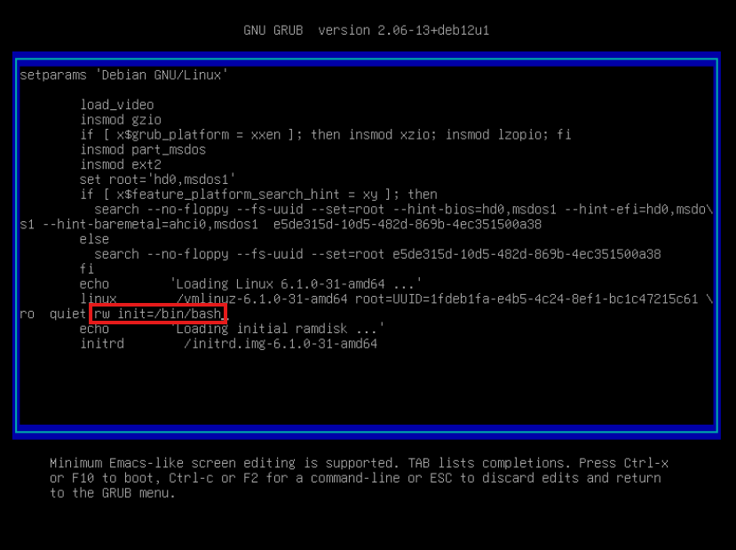

# 11 Загрузка системы

## Описание домашнего задания:  
  [✔] Включить отображение меню Grub.  
  [✔] Попасть в систему без пароля несколькими способами.  
  [✔] Переименовываем LVM с root-разделом на Debian based системах.  

## Выполнение задания:

### Включить отображение меню Grub.
в файле **/etc/default/grub** изменяем (если параметра нет, то добавляем)

```conf
GRUB_TIMEOUT=5
```

Далее выполняем:
```bash
update-grub
```

### Попасть в систему без пароля несколькими способами.

Заходим в меню загрузки, выбираем верхний пункт и нажимаем кнопку **e** (edit)


Добавляем **rw init=/bin/bash** в конец строки, начинающейся с linux и нажимаем **F10**



Меняем пароль и продолжаем загрузку:

```bash
passwd
exec /sbin/init 6
```


Заходим в систему, используя новый пароль

### Переименовываем LVM с root-разделом на Debian based системах:

```bash
lvs
```  
LV     VG       Attr       LSize   Pool Origin Data%  Meta%  Move Log Cpy%Sync Convert  
root   **nginx-vg** -wi-ao----   3.56g  
swap_1 **nginx-vg** -wi-ao---- 980.00m  

```bash
fdisk -l
```  
Disk /dev/sda: 5 GiB, 5368709120 bytes, 10485760 sectors  
Disk model: QEMU HARDDISK  
Units: sectors of 1 * 512 = 512 bytes  
Sector size (logical/physical): 512 bytes / 512 bytes  
I/O size (minimum/optimal): 512 bytes / 512 bytes  
Disklabel type: dos  
Disk identifier: 0x41df4fb4  

Device     Boot   Start      End Sectors  Size Id Type  
/dev/sda1  *       2048   999423  997376  487M 83 Linux  
/dev/sda2       1001470 10483711 9482242  4.5G  5 Extended  
/dev/sda5       1001472 10483711 9482240  4.5G 8e Linux LVM  

Disk /dev/mapper/**nginx--vg**-root: 3.56 GiB, 3825205248 bytes, 7471104 sectors  
Units: sectors of 1 * 512 = 512 bytes  
Sector size (logical/physical): 512 bytes / 512 bytes  
I/O size (minimum/optimal): 512 bytes / 512 bytes  

Disk /dev/mapper/**nginx--vg**-swap_1: 980 MiB, 1027604480 bytes, 2007040 sectors  
Units: sectors of 1 * 512 = 512 bytes  
Sector size (logical/physical): 512 bytes / 512 bytes  
I/O size (minimum/optimal): 512 bytes / 512 bytes 

```bash
cat /etc/fstab | grep nginx
```  
/dev/mapper/**nginx--vg**-root /               ext4    errors=remount-ro 0       1  
/dev/mapper/**nginx--vg**-swap_1 none            swap    sw              0       0  

```bash
cat /boot/grub/grub.cfg | grep nginx
```  
linux   /vmlinuz-6.1.0-18-amd64 root=/dev/mapper/nginx--vg-root ro  quiet  
linux   /vmlinuz-6.1.0-18-amd64 root=/dev/mapper/nginx--vg-root ro  quiet  
linux   /vmlinuz-6.1.0-18-amd64 root=/dev/mapper/nginx--vg-root ro single  

```bash
vgrename nginx-vg otus
```  
  Volume group "nginx-vg" successfully renamed to "otus"

```bash
vgchange -ay
```  
  2 logical volume(s) in volume group "otus" now active

```bash
sed -i 's/nginx--vg/otus/g' /etc/fstab && cat /etc/fstab | grep otus
```  
/dev/mapper/otus-root /               ext4    errors=remount-ro 0       1  
/dev/mapper/otus-swap_1 none            swap    sw              0       0  

```bash
sed -i 's/nginx--vg/otus/g' /boot/grub/grub.cfg && cat /boot/grub/grub.cfg | grep otus
```  
        linux   /vmlinuz-6.1.0-18-amd64 root=/dev/mapper/otus-root ro  quiet
                linux   /vmlinuz-6.1.0-18-amd64 root=/dev/mapper/otus-root ro  quiet
                linux   /vmlinuz-6.1.0-18-amd64 root=/dev/mapper/otus-root ro single

```bash
update-initramfs -c -k all
```  
update-initramfs: Generating /boot/initrd.img-6.1.0-18-amd64  
W: initramfs-tools configuration sets RESUME=/dev/mapper/nginx--vg-swap_1  
W: but no matching swap device is available.  
I: The initramfs will attempt to resume from /dev/dm-1  
I: (/dev/mapper/otus-swap_1)  
I: Set the RESUME variable to override this.

```bash
init 6
```
