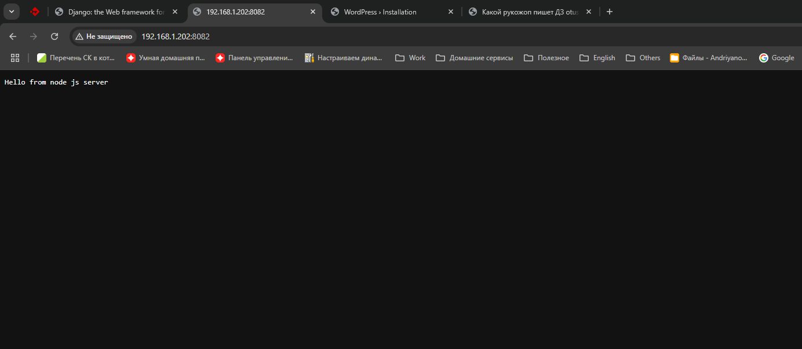

# 42 Динамический веб  

## Описание домашнего задания:  

  [✔] Поднять стерд nginx + php-fpm (wordpress) + python (django) + js(самописная страца)  
  [✔] Реализация: деплой через docker-compose  

Формат сдачи ДЗ - vagrant + ansible  

## Комментарий к моему выполнению:  
Домашняя работа расчитана на выполнение в Debian 12.  

## Выполнение задания:  

Переходим в папку с дз (в моём случае это /opt/otus_homework/42_Dynamic_web) и запускаем проект:
```bash
vagrant up
```
Результатом выполнения команды vagrant up станет созданние иртуальной машины **DynamicWeb**, с **Debian12** и настроенными с помощью Ansible и Docker серверами Web.  

## Результат:

  
  
  
